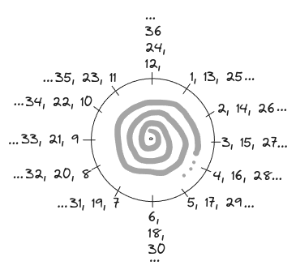

# Fundamental Data Types in C

| Data Type       | Keyword Used  |
|-----------------|---------------|
| Character       | `char`        |
| Integer         | `int`         |
| Floating Point  | `float`       |
| Double Precision| `double`      |
| Void (No Value) | `void`        |

These fundamental data types serve as the building blocks for C programming. However, variations in their **sign modifiers** and **size modifiers** can affect their range and storage capacity respectively.

## Modifiers for Data Types

1. **Sign Modifiers** (`signed` and `unsigned`): Define whether the data type can represent negative values.
2. **Size Modifiers** (`short`, `long`, and `long long`): Adjust the range by changing the memory allocation for certain types.

> **Note**:
>
> - **Sign modifiers** apply mainly to `int` and `char` types, as they can be represented in both signed and unsigned forms.
> - **Size modifiers** apply only to integer types, thus `int`, and partially to floating-point types, where `long double` is an extended precision type.

---

## Sign Modifiers

### Unsigned Modifier

Applicable only to `char` and `int` types, the `unsigned` modifier removes the ability to store negative values, making all bits available to represent larger positive numbers. This means:

- An `unsigned int` type, for example, can represent values from `0` to `2^32 - 1` on a 32-bit system. You see here that all the 32 bits are used giving us the number `2^32` but why `1` is subtracted? -> `1` is subtracted because the range starts from 0. In more layman's terms, you can represent `2^32` different states, but you start counting from zero thus the final state is minus one.

```c
unsigned int x = 300;  // Only stores non-negative values
unsigned char y = 255; // For character data that needs extended range
```

### Signed Modifier

By default, `char` and `int` types are **signed**, which allows them to represent both positive and negative numbers using two's complement notation. The leftmost bit (sign bit) determines the sign:

- **0** for positive numbers
- **1** for negative numbers

Thus, `signed int` and `int` are equivalent in C, both allowing a range of values such as `-2^31` to `2^31 - 1` on a 32-bit system. You see the system was `32-bit` but our range contains the number `31` in exponent as one bit was used for representing sign (`+` or `-`) of the number.

```c
signed int a = -100; // Negative values allowed
char b = -50;        // Signed by default unless specified as unsigned
```

## Size Modifiers

### Short and Long Modifiers

The `short` and `long` modifiers adjust the size of the `int` type, changing the number of bits allocated and thereby the range of representable values.

- `short int` typically uses fewer bytes (often 2 bytes on many systems) and thus has a smaller range, e.g., `-32,768` to `32,767` on a 16-bit system.
- `long int` (or simply `long`) uses more bytes (usually 4 or 8 bytes), allowing larger values than a regular `int`.

```c
short int smallNum = 32767;
long int largeNum = 1000000L;
```

### Long Long Modifier

`long long int` (or `long long`) is an extended version of `long`, typically allocating even more memory, which can handle even larger values (usually 8 bytes).

```c
long long int veryLargeNum = 9223372036854775807;
```

## Extended Data Types List

Following list contains all possible combinations of data types and their modifiers:

```c
/*
char                    // char family
signed char             // char family
unsigned char           // char family
short int               // short int family
signed short int        // short int family
unsigned short int      // short int family
int                     // int family
signed int              // int family
unsigned int            // int family
long int                // long int family
signed long int         // long int family
unsigned long int       // long int family
long long int           // long long int family
signed long long int    // long long int family
unsigned long long int  // long long int family
float                   // floating-point family
double                  // floating-point family
long double             // floating-point family
*/
```

## Concept of Overflow
<!-- add image overflow-chart.png -->


```c
// 4 bytes (32 bits) for int type
// min = -2^31 = -2147483648
// max = 2^31 - 1 = 2147483647
int a = 2147483648; // overflows
printf("%d", a); // -2147483648 
```
